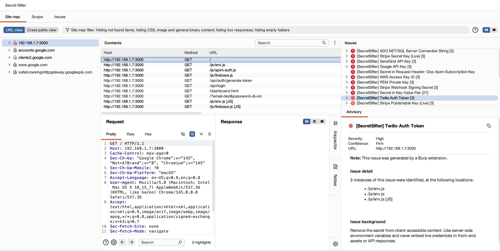
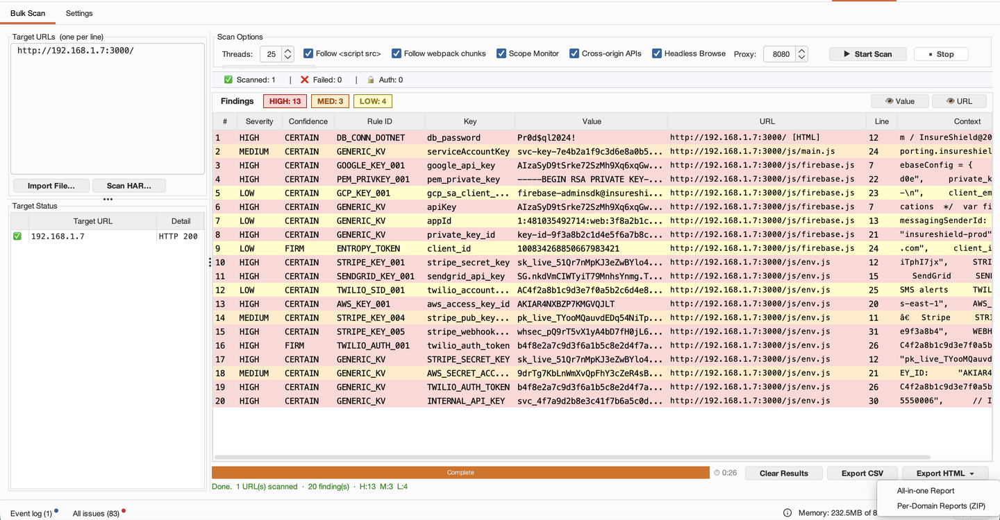
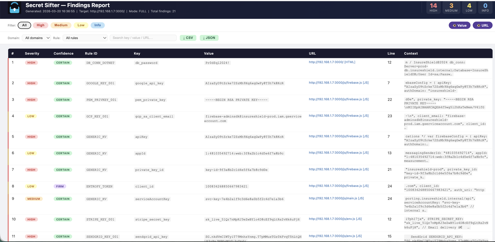
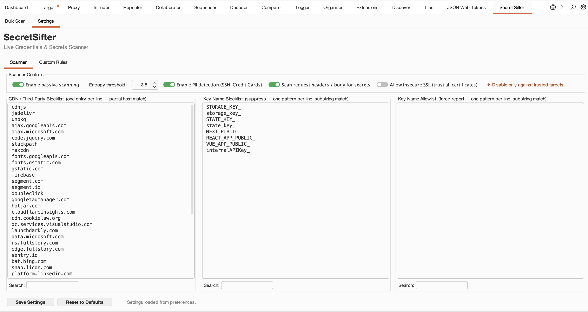
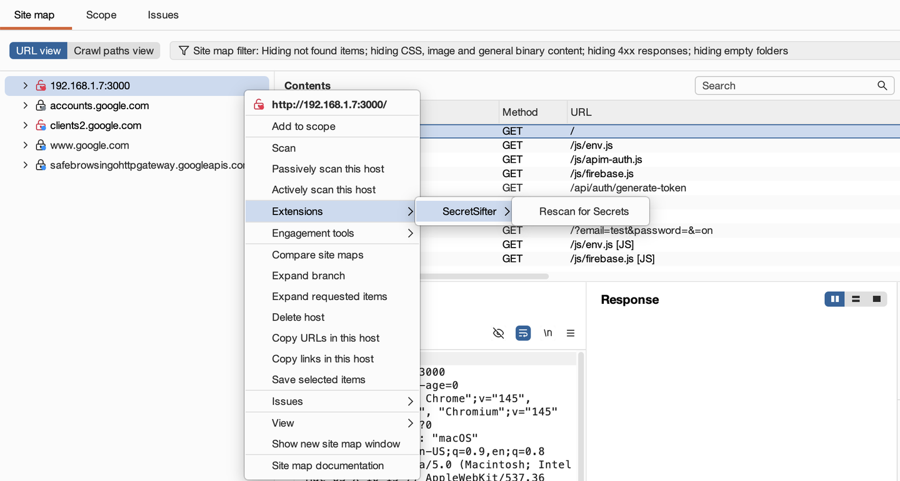
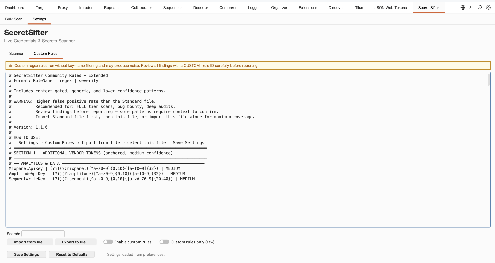

# SecretSifter — Burp Suite Extension

A passive and active secret-detection extension for Burp Suite (Montoya API).
Detects exposed API keys, credentials, PII, JWTs, and connection strings in HTTP traffic.

> **Community Edition note:** Passive scan check registration requires Burp Suite Professional.
> All other features (Bulk Scan, right-click rescan, sitemap sweep, proxy handler) work in
> Community Edition. Findings will appear in the Bulk Scan panel and via the context menu
> rather than in Dashboard → Issue Activity.

---

## Screenshots

| Dashboard — Issue Activity | Bulk Scan tab with live results |
|---|---|
|  |  |

| HTML Report | Settings Tab |
|---|---|
|  |  |

| Right-click Rescan | Custom Rules — raw-mode toggle |
|---|---|
|  |  |

---

## Features

| Feature | Detail |
|---|---|
| **Passive scanning** | Fires on every proxied response automatically; also sweeps existing sitemap on load |
| **100+ anchored token rules** | GitHub, GitLab, AWS, Stripe, OpenAI, Slack, Shopify, Azure, GCP, Docker Hub, Clerk, and more |
| **40+ context-gated rules** | Algolia, Cloudflare, Zendesk, Heroku, Datadog, Salesforce, Mistral, Cohere, Auth0, Supabase, and more |
| **Request header scanning** | Detects credentials in custom headers (e.g. `App_key`, `Resource`, `Ocp-Apim-Subscription-Key`) |
| **Generic KV & high-entropy scanner** | Catches unlisted keys using keyword + entropy heuristics |
| **PII detection** | SSN, credit card numbers (Luhn-validated), credential-bearing URLs |
| **Bulk Scan tab** | Paste/import URL lists; follows `<script src>`, webpack chunks; 1–50 concurrent threads |
| **HAR import** | Scan responses from a `.har` file directly — no live fetch needed (useful for auth-walled or offline targets) |
| **Headless Browse** | Optionally launch Chrome/Chromium headless through Burp proxy to capture dynamic XHR/Fetch calls |
| **Scope Monitor** | Capture passive proxy findings for watched hosts and route them into the Bulk Scan results table |
| **HTML reports** | Per-scan all-in-one HTML report (HTML + findings CSV + target-status CSV); per-domain ZIP (one file per hostname + same two CSVs) |
| **Scan tiers** | FAST / LIGHT / FULL — trade speed vs. coverage |
| **Key name blocklist / allowlist** | Suppress FP-prone key patterns or force-report specific key names regardless of entropy |
| **FP mitigations** | CDN blocklist, 60+ noise key filter, Angular/Vue directive filter, JWT suppression, UUID rejection |
| **Custom regex rules** | Import `Rule Name \| regex \| severity` lines via Settings. Optional **Custom rules only (raw)** toggle skips built-in scanners + FP filters and reports every regex match — useful for live investigation of a known token format |
| **NOISE marking** | Set Severity *or* Confidence to `NOISE` on any finding row to gray it out and exclude it from HTML / CSV / ZIP exports while keeping it visible in the table for unmarking |
| **Per-occurrence dedup** | Same key+value at different file offsets (or different lines) reported as separate findings — minified bundles with N matches produce N rows, not one |

---

## Network Communications

SecretSifter does not make any outbound network connections by default. All findings are
detected locally by Burp's proxy and passive scan engine. Network activity occurs only when
the user explicitly triggers it.

| User action | Destination | Data sent |
|---|---|---|
| **Bulk Scan** tab → *Start* | The user's configured Burp proxy → user-pasted target URLs | The HTTP requests Burp would normally make for those URLs |
| **Bulk Scan** → *Headless Browse* enabled | Local Chrome/Chromium process launched as child process; traffic routed through the user's Burp proxy | Standard browser navigation to the user-pasted URLs |

**No telemetry:** The extension does not phone home, send usage statistics, check for
updates, or perform any background network activity. The only outbound network calls are
the ones listed above, all of which are user-initiated.

---

## Requirements

| Component | Version |
|---|---|
| Burp Suite Professional | 2024.7+ (Montoya API) |
| Burp Suite Community | 2024.7+ (Bulk Scan, rescan, and proxy handler work; passive scan check skipped) |
| Java | 17+ (bundled with Burp) |
| OS | macOS (Intel / Apple Silicon), Windows (x64), or Linux |

---

## Installation

### 1. Download the JAR

Download `secretsifter-1.0.1.jar` from the Releases page, or build it yourself (see below).

### 2. Load into Burp

1. Open Burp Suite → **Extensions** tab → **Installed** → **Add**
2. Set **Extension type**: Java
3. Browse to `secretsifter-1.0.1.jar`
4. Click **Next** — the extension loads and a **Secret Sifter** tab appears in the main tab bar

---

## Usage

### Passive Scanning (automatic)

Once loaded, the extension scans every response passing through the Burp proxy. Findings appear in:
- **Dashboard → Issue Activity** (as Burp AuditIssues — Pro only)
- The **Secret Sifter → Bulk Scan** results table (all editions)

On load, the extension also sweeps all responses already recorded in **Target → Site map** so that
findings appear immediately — even for traffic captured before the extension was installed.

No configuration required.

### Right-click Rescan

In **Proxy → HTTP History** or **Repeater**, right-click any request → **Rescan for Secrets**.
Expands to all site-map entries for the selected host(s). Optionally save an HTML report after the scan.

### Bulk Scan Tab

1. Navigate to **Secret Sifter → Bulk Scan**
2. Paste one URL per line into the URL box (or import a `.txt` / `.csv` file, or import a `.har` file)
3. Choose scan tier and thread count
4. Click **▶ Start Scan**
5. Results populate the table in real time
6. Export as **CSV**, **HTML Report**, or **HTML Report (per domain)**

**Bulk Scan options:**

| Option | Description |
|---|---|
| Tier | FAST (anchored tokens only) / LIGHT (+ entropy) / FULL (+ PII, KV, SSR blobs) |
| Threads | 1–50 concurrent URL workers (default 25) |
| Follow script-src | Fetch and scan `<script src>` URLs found in HTML responses |
| Follow webpack chunks | Follow chunk references inside JS bundles (depth 1) |
| Scope Monitor | Capture passive-scan findings from Burp proxy traffic for watched hosts |
| Cross-origin APIs | Capture XHR/Fetch calls fired from a watched host to other domains |
| Headless Browse | Launch Chrome/Chromium headless through Burp proxy to capture dynamic JS API calls |
| Scan Site Map | Scan all JS/HTML responses already captured in Burp's site map |

### Settings Tab

| Setting | Description |
|---|---|
| Scan Tier | FAST / LIGHT / FULL |
| Entropy Threshold | Minimum Shannon entropy for high-entropy scanner (default: 3.5 bits/char) |
| PII Detection | Enable/disable SSN and credit card scanning |
| Scan request headers | Scan custom request headers (e.g. `App_key`, `Resource`) for credentials |
| CDN Blocklist | Hostnames to skip (one per line; pre-populated with common CDN/analytics domains) |
| Key Name Blocklist | Substring patterns — matching key names are suppressed (e.g. `STATE_KEY_`, `NEXT_PUBLIC_`) |
| Key Name Allowlist | Substring patterns — matching key names are always reported regardless of entropy |
| Custom Rules | Paste/import `Rule Name \| regex \| severity` lines (one per line). Toggle *Enable custom rules* to run them alongside built-in rules |
| Custom rules only (raw) | When ON, skip built-in scanners and FP filters — only your regex rules fire. Allow/blocklist/CDN list still apply. Default: OFF |

---

## Scan Tiers

| Tier | Rules Active | Use When |
|---|---|---|
| **FAST** | 100+ anchored vendor tokens | Quick recon, large site maps |
| **LIGHT** | + High-entropy scanner + 40+ context-gated rules + DB strings | Standard pentest |
| **FULL** | + PII (SSN, CC) + Generic KV + SSR state blobs + JSON walker + getter functions | Deep audit, bug bounty |

---

## Building from Source

### Prerequisites

- Java 17+
- Gradle 8+ (or use `./gradlew`)

### Build

```bash
git clone https://github.com/secretsifter/secretsifter-burp
cd secretsifter-burp
./gradlew shadowJar
```

Output: `build/libs/secretsifter-1.0.1.jar` (~554 KB)

### Run tests

```bash
./gradlew test
```

Test report: `build/reports/tests/test/index.html`

---

## Severity Levels

| Level | Meaning |
|---|---|
| **HIGH** | Confirmed active credentials — rotate immediately |
| **MEDIUM** | Tokens that confirm a live service integration |
| **LOW** | Identifiers or keys with limited standalone risk |
| **INFORMATION** | Structural or schema-level findings |

---

## False Positive Reduction

The extension includes built-in noise filtering, entropy thresholds, CDN domain skipping, and structural validation (Luhn, SSN format checks) to keep results actionable.
User-configurable key name blocklist and allowlist are available in the Settings tab.

---

## Troubleshooting

### Extension does not load
- Verify Burp Suite version is 2024.7 or later
- Check the **Extensions → Output** tab for error messages
- Confirm you are loading the **shadow JAR** (`secretsifter-1.0.1.jar`), not the plain compile output

### No findings appear for a known secret
- Check **Settings → Scan Tier** — switch to FULL for maximum coverage
- Verify the response is flowing through Burp's proxy (not directly)
- For JS-heavy SPAs: use **Bulk Scan** with **Follow script-src** and **Follow webpack chunks** enabled,
  or browse the target through Burp Browser first then use **Scan Site Map**
- For secrets in request headers (e.g. `App_key`): confirm **Scan request headers** is enabled in Settings

### Burp slows down during passive scan
- Switch Scan Tier to **FAST** in Settings
- Expand the CDN blocklist to skip high-volume analytics traffic
- Disable PII scanning if not needed (Settings → PII Detection → Off)

### Headless Browse does nothing / Chrome not found
- Ensure Google Chrome or Chromium is installed and on `PATH`
- On macOS: `/Applications/Google Chrome.app` is detected automatically
- Check the **Extensions → Output** tab for `[Headless] Chrome/Chromium not found` messages
- The feature routes all traffic through Burp proxy — ensure Burp is listening on the configured port

> **Security note:** Headless Browse is opt-in and requires explicit user consent on first use.
> All traffic is routed exclusively through Burp's local proxy — no data leaves your machine.
> Each scan uses an isolated Chrome profile (`--user-data-dir` in system temp) that is discarded after the scan.

### Findings in Bulk Scan table but not in Dashboard
- Dashboard → Issue Activity requires Burp Suite **Professional**
- In Community Edition, all findings are available in the Bulk Scan table and HTML/CSV export

---

## Credits

Vendor token format specifications are publicly documented by their respective service providers.
See [NOTICE](NOTICE) for details.

---

## License

MIT License — free to use, modify, and distribute. See [LICENSE](LICENSE) for full terms.
